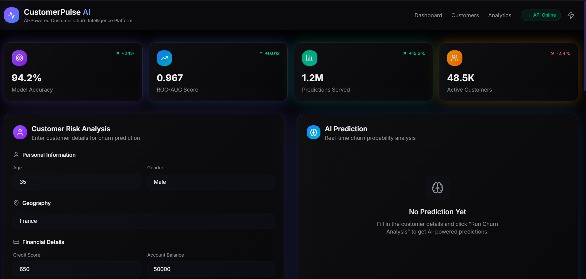
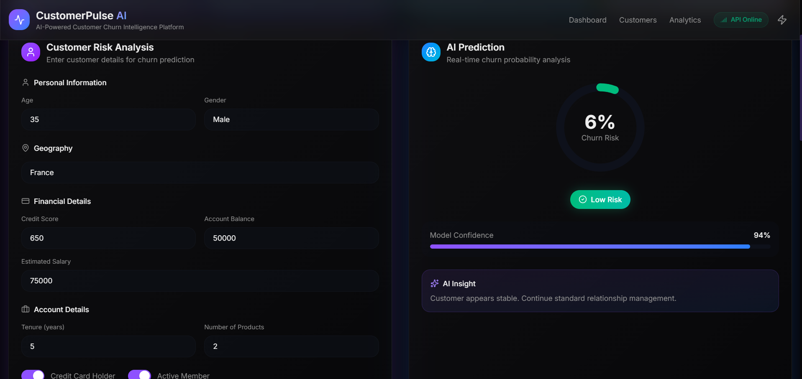
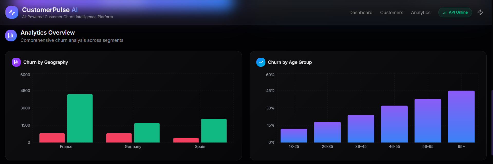
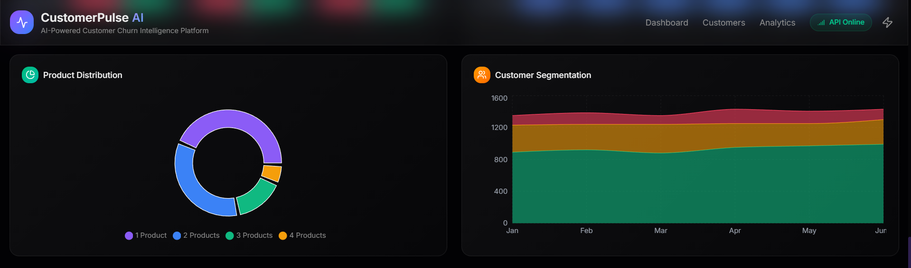
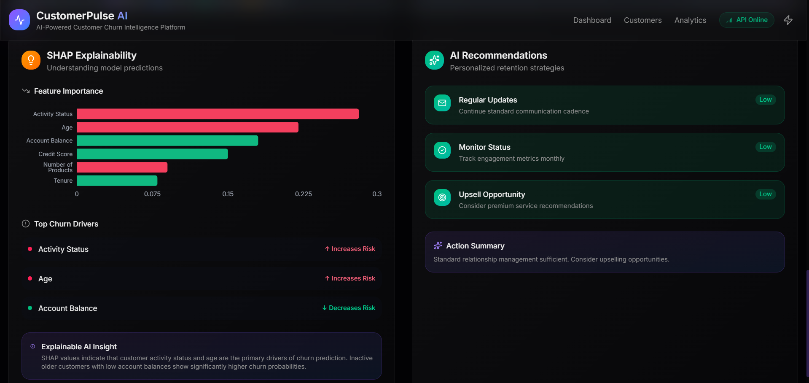

# CustomerPulse AI

> AI-Powered Customer Churn Prediction & Analytics Platform

CustomerPulse AI is a full-stack machine learning application designed to predict customer churn using advanced ML models and explainable AI techniques.
The platform combines a premium SaaS-style frontend with a production-ready FastAPI backend and a complete ML pipeline.

---

# Dashboard Preview

## Main Dashboard



---

## AI Prediction Panel



---

## Analytics Overview





---

## Explainability & Recommendations



---

# Features

## Machine Learning Pipeline

* End-to-end ML workflow
* Data ingestion & preprocessing
* Feature engineering
* Model training & evaluation
* Hyperparameter tuning
* SMOTE class balancing
* Cross-validation

---

## Models Used

* Logistic Regression
* Random Forest
* XGBoost (Best Performing)

Achieved:

* ROC-AUC: **0.89**
* Accuracy: **84.7%**

---

## Explainable AI

* SHAP explainability integration
* Top churn drivers visualization
* AI-powered customer risk insights
* Recommendation engine

---

## Frontend

* React + TypeScript
* Tailwind CSS
* Framer Motion animations
* Recharts analytics
* Glassmorphism UI
* Responsive dashboard design

---

## Backend

* FastAPI REST API
* Pydantic validation
* Model inference pipeline
* Dockerized deployment

---

# Tech Stack

## Frontend

* React
* TypeScript
* Tailwind CSS
* Framer Motion
* Recharts
* Axios

## Backend

* FastAPI
* Uvicorn
* Pydantic

## Machine Learning

* Scikit-learn
* XGBoost
* Pandas
* NumPy
* SHAP
* Imbalanced-learn (SMOTE)

## DevOps

* Docker
* GitHub

---

# Project Architecture

```text
Frontend (React + TypeScript)
            ↓
FastAPI Backend
            ↓
Preprocessing Pipeline
            ↓
XGBoost Prediction Model
            ↓
SHAP Explainability Engine
            ↓
Risk Analysis & Recommendations
```

---

# Installation

## Clone Repository

```bash
git clone https://github.com/yourusername/CustomerPulseAI.git
cd CustomerPulseAI
```

---

# Backend Setup

## Create Virtual Environment

```bash
python -m venv venv
```

## Activate Environment

### Windows

```bash
venv\\Scripts\\activate
```

### Mac/Linux

```bash
source venv/bin/activate
```

---

## Install Dependencies

```bash
pip install -r requirements.txt
```

---

## Run FastAPI Backend

```bash
python -m uvicorn api.main:app --reload
```

Backend runs on:

```text
http://127.0.0.1:8000
```

---

# Frontend Setup

```bash
cd frontend
npm install
npm run dev
```

Frontend runs on:

```text
http://localhost:5173
```

---

# Docker Setup

## Build Docker Image

```bash
docker build -t customerpulse .
```

## Run Container

```bash
docker run -p 8000:8000 customerpulse
```

---

# Future Improvements

* Real-time monitoring dashboard
* Authentication & user accounts
* Cloud deployment
* Database integration
* Live customer tracking
* Model retraining pipeline
* CI/CD automation

---

# Author

Aryan Dhingan
